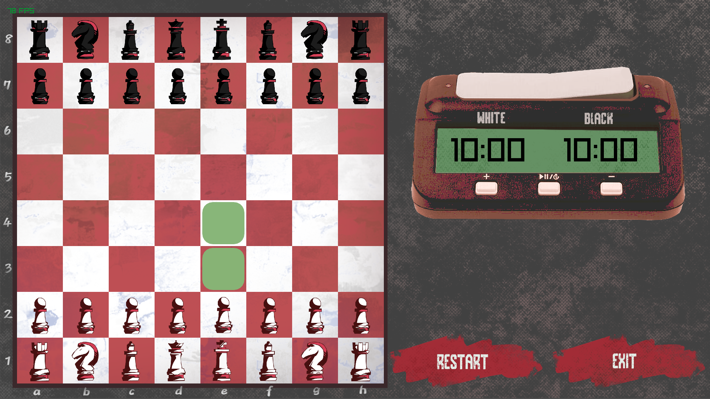

<div align="center">
<h1>
ChessRay
</h1>

A chess game written in python with <a href="https://www.raylib.com/"> Raylib </a>

 

</div>



---

# Installation (Linux)

- clone the project

```
git clone https://github.com/nearlynithin/chessray
```

- initialize an environment and activate

```
cd chessray
python3 -m venv venv
source venv/bin/activate
```

- install dependencies

```
python3 -m pip install -r requirements.txt
```

- Run the game

```
python3 main.py
```

---

# TODO

- [ ] Chess engine
- [ ] Multiplayer
- [ ] UI improvements
